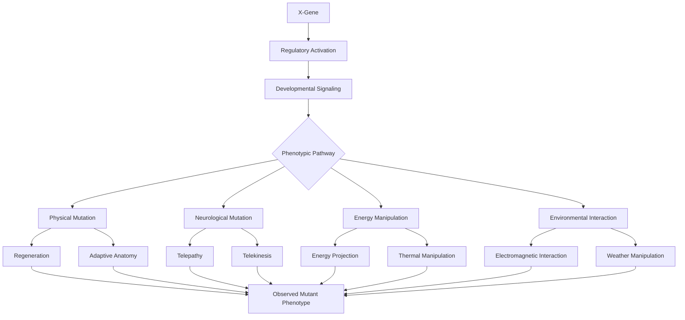
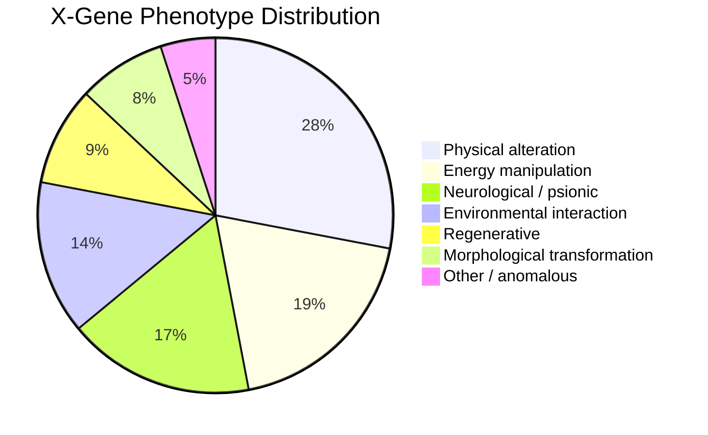
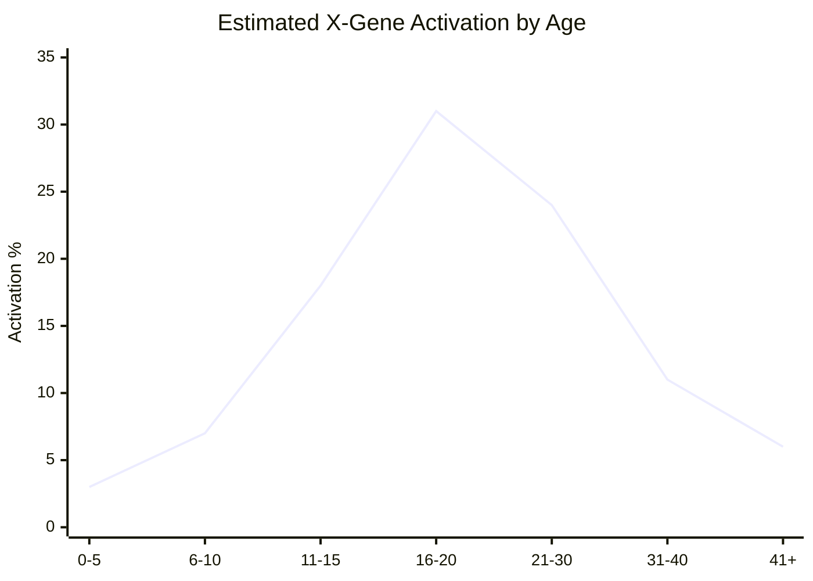
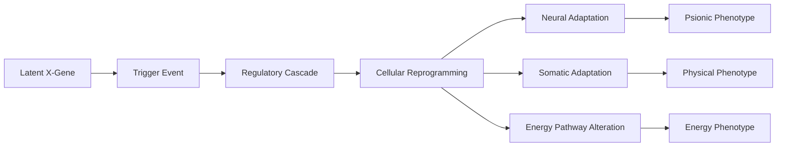
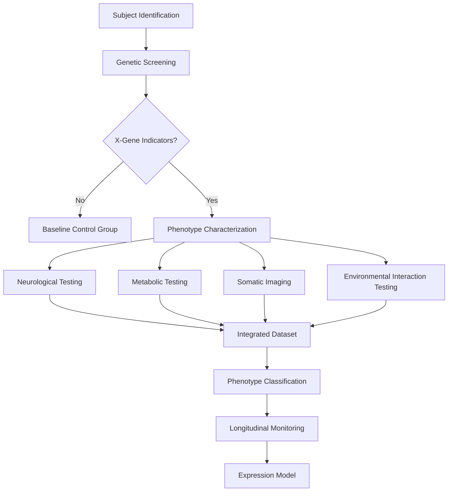

# X-Gene: R&D Characterization Report

> **Research classification:** Mutant genetics / metabiological expression  
> **Subject:** Homo superior phenotype  
> **Status:** Exploratory  
> **Note:** The X-gene is a fictional biological construct from the *X-Men* universe. This document is written as an in-universe-style R&D exercise for UI/rendering testing.

---

## 1. Executive Summary

The **X-gene** is a hypothetical inheritable genetic element capable of producing highly variable phenotypic traits in humans. Unlike conventional single-gene disorders, X-gene expression appears to influence multiple biological systems, including:

- Neurological function
- Cellular regeneration
- Electromagnetic interaction
- Somatic morphology
- Energy generation and projection
- Environmental adaptation
- Potentially cognitive or psionic capabilities

The defining characteristic of the X-gene is **extreme phenotypic diversity**. Two individuals carrying the mutation may exhibit completely different abilities, suggesting that expression is influenced by multiple downstream biological pathways rather than a single deterministic mechanism.

---

## 2. Research Objectives

The current R&D program focuses on five questions:

1. **Inheritance** — How is the X-gene transmitted between generations?
2. **Expression** — Why does activation occur at different developmental stages?
3. **Phenotypic variance** — Why do carriers exhibit drastically different abilities?
4. **Energy requirements** — How can certain expressions apparently violate conventional metabolic constraints?
5. **Evolutionary role** — Is the mutation harmful, neutral, adaptive, or some combination of all three?

---

## 3. Proposed Biological Model

A simplified model treats the X-gene as an upstream regulatory mechanism rather than a conventional "ability gene."



This model implies that the X-gene does not directly encode a specific superhuman ability. Instead, it may act as an **activation layer** that alters developmental and physiological pathways.

---

## 4. Phenotypic Distribution

For testing purposes, a hypothetical dataset was constructed across 1,000 observed mutant subjects.

| Phenotypic Class | Estimated Subjects | Percentage |
|---|---:|---:|
| Physical alteration | 280 | 28% |
| Energy manipulation | 190 | 19% |
| Neurological / psionic | 170 | 17% |
| Environmental interaction | 140 | 14% |
| Regenerative | 90 | 9% |
| Morphological transformation | 80 | 8% |
| Other / anomalous | 50 | 5% |

The distribution suggests that no single expression pathway dominates the population.

### Hypothetical phenotype distribution



---

## 5. Activation Timeline

A recurring question is **when** X-gene expression becomes biologically significant.

The following dataset represents a fictional cohort:

| Age Range | Activation Rate |
|---|---:|
| 0–5 | 3% |
| 6–10 | 7% |
| 11–15 | 18% |
| 16–20 | 31% |
| 21–30 | 24% |
| 31–40 | 11% |
| 41+ | 6% |

The strongest activation window appears to coincide with adolescence and early adulthood.

### Hypothetical activation curve



> **Interpretation:** The peak around ages 16–20 may indicate a relationship between X-gene activation and hormonal or developmental transitions.

---

## 6. Expression Cascade

A possible activation sequence is:



Potential trigger events may include:

- Pubertal development
- Severe physical stress
- Neurological trauma
- Environmental exposure
- Extreme emotional stress
- Spontaneous developmental activation

The trigger itself should not be assumed to **cause** the mutation. It may simply expose a phenotype that was already genetically encoded.

---

## 7. Energy Budget Hypothesis

Several mutant phenotypes appear to produce energy outputs far beyond what ordinary human metabolism could supply.

This creates one of the largest theoretical problems in X-gene research.

A conventional metabolic model can be represented as:

```text
Energy Output <= Metabolic Input + Stored Chemical Energy
```

However, high-output mutant phenotypes appear to behave closer to:

```text
Energy Output >> Metabolic Input
```

Possible explanations include:

1. Direct interaction with external energy fields
2. Conversion of environmental energy
3. Unknown biological energy-storage mechanisms
4. Manipulation of physical forces rather than conventional energy generation
5. A fictional physics layer not represented by ordinary biological models

---

## 8. Cross-Phenotype Comparison

| Trait | Conventional Biology | Hypothetical X-Gene |
|---|---|---|
| Genetic inheritance | Relatively predictable | Highly variable |
| Development | Environmentally influenced | Environment + latent activation |
| Energy production | Metabolic pathways | Potential external coupling |
| Regeneration | Limited | Potentially extreme |
| Neural processing | Human physiological limits | Potentially expanded |
| Morphological change | Slow / constrained | Potentially rapid |
| Environmental interaction | Passive | Potentially active |

---

## 9. Proposed Research Pipeline



---

## 10. Risk Assessment

The X-gene creates several research risks:

- **Uncontrolled activation**
- **Unexpected secondary mutations**
- **Psychological stress caused by phenotype emergence**
- **Potential involuntary harm to surrounding individuals**
- **Inability to reproduce certain manifestations under controlled conditions**
- **Large uncertainty in long-term physiological effects**

The most significant concern is that the biological system may be **adaptive rather than static**.

A mutant phenotype that changes in response to repeated stress could invalidate conventional safety assumptions.

---

## 11. Working Hypothesis

The current working hypothesis is:

> The X-gene is best modeled as a **multi-pathway developmental regulator** capable of activating dormant biological mechanisms whose expression varies according to genotype, environment, development, and neurological state.

This would explain why:

- abilities vary dramatically between individuals,
- activation can occur at different ages,
- some phenotypes remain dormant for years,
- abilities may evolve after initial manifestation,
- and apparently unrelated abilities can still share a common genetic origin.

---

## 12. Open Research Questions

### Genetics

- Is there a single X-gene sequence or a family of related loci?
- Does the mutation follow dominant, recessive, or more complex inheritance?
- Are spontaneous mutations possible?
- Can non-carriers acquire expression through artificial intervention?

### Physiology

- What biological mechanism enables extreme regeneration?
- How does tissue restructuring avoid catastrophic cellular instability?
- Where does additional energy originate?
- Can metabolic exhaustion suppress mutant abilities?

### Neuroscience

- Are psionic phenotypes associated with measurable neurological changes?
- Can neural activity predict the onset of ability expression?
- Does repeated use permanently alter brain structure?

### Evolution

- Does the X-gene provide an evolutionary advantage?
- Is mutation frequency increasing over generations?
- Could environmental conditions influence expression frequency?

---

## 13. Conclusion

The X-gene represents a useful fictional model for studying how a single underlying biological mechanism might produce a broad family of highly divergent phenotypes.

From an R&D perspective, the key challenge is not identifying **what** ability a mutant possesses, but understanding **why one regulatory system can produce so many different outcomes**.

The strongest candidate model is therefore a layered system:


Further investigation should prioritize longitudinal observation, phenotype classification, and identification of common molecular signatures across apparently unrelated mutant abilities.

**End of R&D Report**